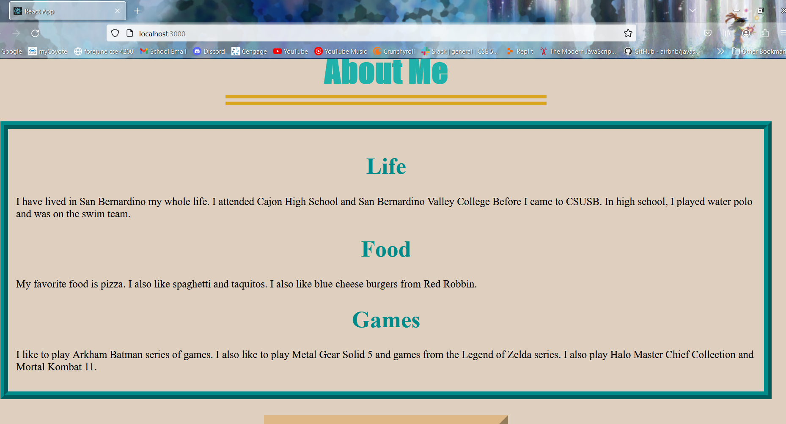
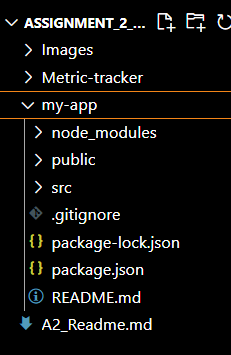
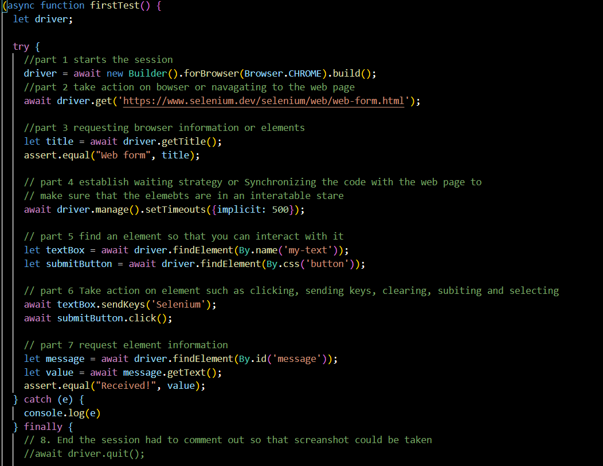
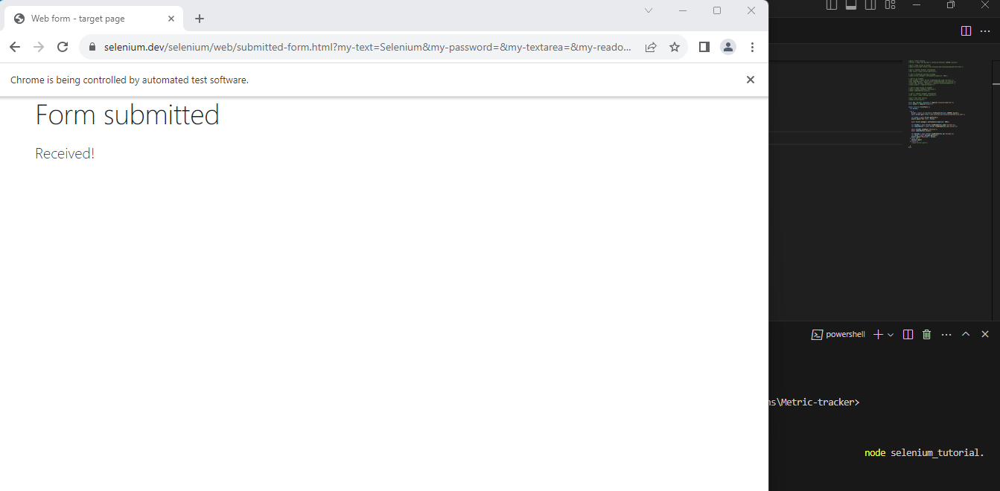
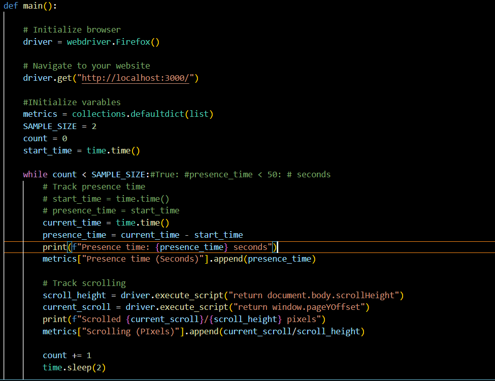

# Metric Tracker

PROVIDE OVERVIEW OF ASSIGNMENT HEREZ

Time spent: **NUMBER_HOURS_SPENT** hours spent in total

## Features

The following **required** features are completed:

- [X] Organize Github project for Assignment 2 (2 pt)
- [X] Transfer your About Me Page into a React App with screenshot of output in the Images folder(3 pt)
- [X] Set up Selenium (2 pt)
- [X] Write your first Selenium script with screenshot of output in the Images folder (4 pt)
- [X] Monitor at least 2 metrics using Selenium with screenshot of output in the Images folder (4 pt)

The following **bonus** features are implemented:

- [ ] Saves metrics into csv file (1 pt)
- [ ] Monitors at least 4 metrics (1 pt)
- [ ] DESCRIBE ANY OTHER FEATURES HERE.

## Screenshot and/or Video Walkthrough

## Notes:
PROVIDE RELEVANT OR ADDITIONAL INFORMATION HERE. Below are formatting options to add emphasis in text

I Could not get the  metric-tracker python code to work becasue the openssl needed to be updated however the metric-tracker code works as discussed in class.

